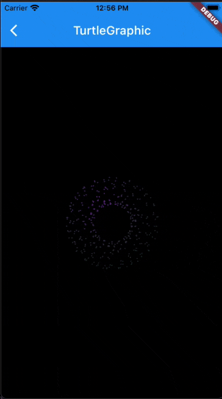

# Flutter Fractal

A Flutter package to create a Fractal Art with multiple drawing types such as Turtle Graphic, Mathematics. It will be useful for your awesome app.
You can use this to create many of awesome artworks for your awesome apps. Such as: Loading indicator, Progressing indicator, Splash Screen, Button effects, ...

More from [Romantic Developer](https://pub.dev/publishers/romanticdeveloper.com/packages)



### Example

```dart
import 'dart:ui' as ui;

import 'package:flutter/material.dart';
import 'package:flutter_fractal/flutter_fractal.dart';

void main() => runApp(MyApp());

class MyApp extends StatefulWidget {
  @override
  _MyAppState createState() => _MyAppState();
}

class _MyAppState extends State<MyApp> {
  @override
  Widget build(BuildContext context) {
    return MaterialApp(
      title: 'Example',
      theme: ThemeData(
        primarySwatch: Colors.blue,
        backgroundColor: Colors.black,
      ),
      home: HomePage(),
    );
  }
}

class HomePage extends StatefulWidget {
  @override
  _HomePageState createState() => _HomePageState();
}

class _HomePageState extends State<HomePage>
    with SingleTickerProviderStateMixin {
  late TurtleGraphic path;
  late AnimationController controller;
  late List<Color> colors;
  @override
  void initState() {
    controller =
        AnimationController(vsync: this, duration: Duration(seconds: 2));
    controller.addListener(() {
      setState(() {
        create();
      });
    });
    controller.repeat(reverse: true);
    colors = List.generate(10, (index) => randomColor());
    create();
    super.initState();
  }

  @override
  void dispose() {
    controller.dispose();
    super.dispose();
  }

  @override
  void didUpdateWidget(covariant HomePage oldWidget) {
    colors = List.generate(10, (index) => randomColor());
    create();
    super.didUpdateWidget(oldWidget);
  }

  @override
  Widget build(BuildContext context) {
    var size = MediaQuery.of(context).size;
    return Scaffold(
      appBar: AppBar(
        title: Text('TurtleGraphic'),
      ),
      backgroundColor: Colors.black,
      body: CustomPaint(
        painter: TurtleGraphicsPainter(
          path: path,
          brush: Paint()
            ..color = Colors.white
            ..strokeWidth = 1
            ..style = PaintingStyle.stroke
            ..strokeCap = StrokeCap.round
            ..strokeJoin = StrokeJoin.round
            ..shader = ui.Gradient.radial(
              Offset.zero,
              size.width,
              this.colors.map((e) => e).skip(6).toList(),
              [0.0, 0.3, 0.6, 1.0],
            ),
        ),
        size: MediaQuery.of(context).size,
      ),
    );
  }

  void create() {
    var av = controller.value;
    path = TurtleGraphic()
      ..addSpiral(
        alpha: 30,
        distance: Tween<double>(begin: 10, end: 30).transform(av),
        count: 12,
        builder: (path) {
          var a = 12.0;
          path.addSpiral(
            alpha: a,
            distance: Tween<double>(begin: 10, end: 40).transform(av),
            deltaDistance: 1,
            count: 360 ~/ a,
            deltaAlpha: 1,
            builder: (path) {
              path.addOval(Rect.fromCenter(
                center: path.currentPoint,
                width: Tween<double>(begin: 1, end: 5).transform(av),
                height: Tween<double>(begin: 1, end: 5).transform(av),
              ));
            },
          );
        },
      );
  }
}

```

### Development environment

```
[✓] Flutter (Channel stable, 2.0.5, on macOS 11.2.3 20D91 darwin-x64, locale en-VN)
    • Flutter version 2.0.5
    • Framework revision adc687823a (11 days ago), 2021-04-16 09:40:20 -0700
    • Engine revision b09f014e96
    • Dart version 2.12.3

[✓] Android toolchain - develop for Android devices (Android SDK version 30.0.3)
    • Platform android-30, build-tools 30.0.3
    • Java binary at: /Applications/Android Studio.app/Contents/jre/jdk/Contents/Home/bin/java
    • Java version OpenJDK Runtime Environment (build 1.8.0_242-release-1644-b3-6915495)
    • All Android licenses accepted.

[✓] Xcode - develop for iOS and macOS
    • Xcode at /Applications/Xcode_12.app/Contents/Developer
    • Xcode 12.4, Build version 12D4e
    • CocoaPods version 1.10.1

[✓] Chrome - develop for the web
    • Chrome at /Applications/Google Chrome.app/Contents/MacOS/Google Chrome

[✓] Android Studio (version 4.1)
    • Android Studio at /Applications/Android Studio.app/Contents
    • Flutter plugin can be installed from:
      🔨 https://plugins.jetbrains.com/plugin/9212-flutter
    • Dart plugin can be installed from:
      🔨 https://plugins.jetbrains.com/plugin/6351-dart
    • Java version OpenJDK Runtime Environment (build 1.8.0_242-release-1644-b3-6915495)
```